# 1. The JPL Small-Body Database
The JPL Small-Body Database is about small Solar System objects. It contains data of all known asteroids and several comets. 
You can learn a bit by downloading and analysing the database. I used R (https://www.r-project.org) to filter and plot the data. Basic data and orbital elements of Asteroids can be found at the **JPL Small-Body Database Engine** (https://ssd.jpl.nasa.gov/sbdb_query.cgi#x).
The URL might change in the future. The JPL HORIZONS System should have a link to the small body database search engine.

You can select and download physical and orbital parameters of asteroids and comets. In this example only asteroids have been selected (asteroid - basic), (asteroid - physical), including Near-Earth Object (NEO) and Potentially Hazardous Asteroid (PHA). The resulting table was downloaded as a CSV-file of 157 MB, 796,926 rows and 27 columns. A description of the columns is in the appendix.

To analyse the data we need a few R packages. For data manipulation and filtering and plotting we use the tidyverse package.
We are dealing with a large amount of data, using the data.table package is faster than R's dataframe.
If this notebook is run from the same folder as our input data "asteroid.csv" then you don't need to set a folder. Otherwise use getwd() and setwd("/path/to/folder") to read and set the working directory.
First read the CSV file with the asteroid data.  Then create a data table with the semi-major axis and eccentricity of a few planets which we use in later plots. (https://nssdc.gsfc.nasa.gov/planetary/factsheet/planet_table_ratio.html)


```r
library(data.table)
library(tidyverse)
```

```
## ── Attaching packages ─────────────────────────────────────── tidyverse 1.3.0 ──
```

```
## ✓ ggplot2 3.3.3     ✓ purrr   0.3.4
## ✓ tibble  3.1.0     ✓ dplyr   1.0.4
## ✓ tidyr   1.1.3     ✓ stringr 1.4.0
## ✓ readr   1.4.0     ✓ forcats 0.5.1
```

```
## ── Conflicts ────────────────────────────────────────── tidyverse_conflicts() ──
## x dplyr::between()   masks data.table::between()
## x dplyr::filter()    masks stats::filter()
## x dplyr::first()     masks data.table::first()
## x dplyr::lag()       masks stats::lag()
## x dplyr::last()      masks data.table::last()
## x purrr::transpose() masks data.table::transpose()
```

```r
ast_df <- fread("asteroids.csv", header = TRUE)
planets <- data.table()
planets$names <- c('Mercury', 'Venus', 'Earth', 'Mars', 'Jupiter')
planets$a <- c(0.387, 0.723, 1, 1.52, 5.20)
planets$e <- c(0.205, 0.007, 0.017, 0.094, 0.049)
```
There are a few warnings about conflicts which we ignore.

# 2. Plot of eccentricity vs. semi-major axis
Lets try a first plot of eccentricity (e) versus semi-major axis (a) in AU. There are about 800,000 objects in the data.table and the code might take a while to run!

```r
ggplot(data = ast_df) + geom_point(mapping = aes(x = a, y = e))
```

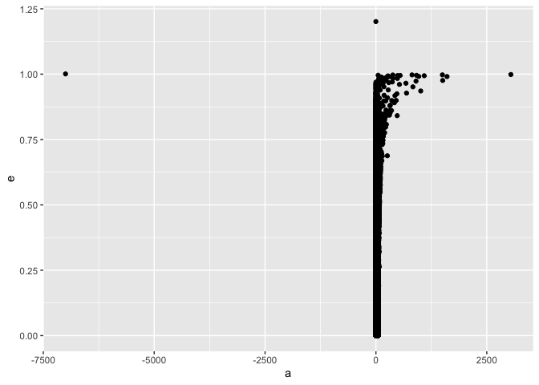<!-- -->

There are two objects without a value of semi-major axis (a) and two with negative semi-major axis, "(A/2017 U7)" and "'Oumuamua (A/2017 U1)". We only want objects with positive semi-major axis. By applying a filter from the dplyr package we get exactly that. 

```r
ast_df <- ast_df %>% filter(a >= 0)
```
Next we set the colour to steel-blue, use the option **shape** to get smaller data points in the plot, scale the x-axis logarithmic and add proper labels to the axis.

```r
ggplot(data = ast_df) + geom_point(mapping = aes(x = a, y = e), shape = ".", color = "steelblue") + 
  scale_x_log10() + labs (x = "semi-major axis (a) in AU", y = "eccentricity (e)")
```

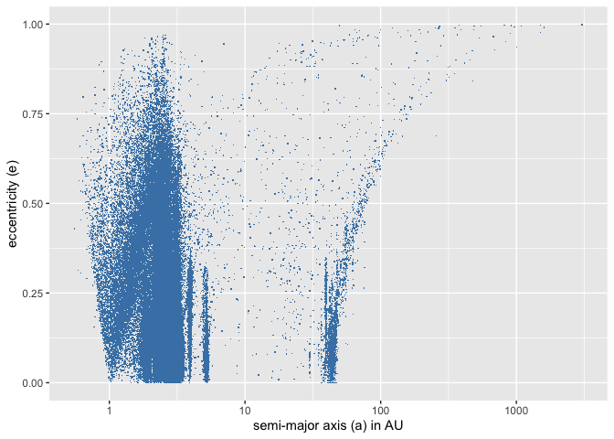<!-- -->
The x-axis is logarithmic in astronomical units (AU).
Next we look at the range of 0 - 6 AU semi-major axis by applying a limit with the **xlim()** option.

```r
ggplot(data = ast_df) + geom_point(mapping = aes(x = a, y = e), shape = ".", color = "steelblue") + 
  xlim(c(0,6)) + labs (x = "semi-major axis (a) in AU", y = "eccentricity (e)")
```

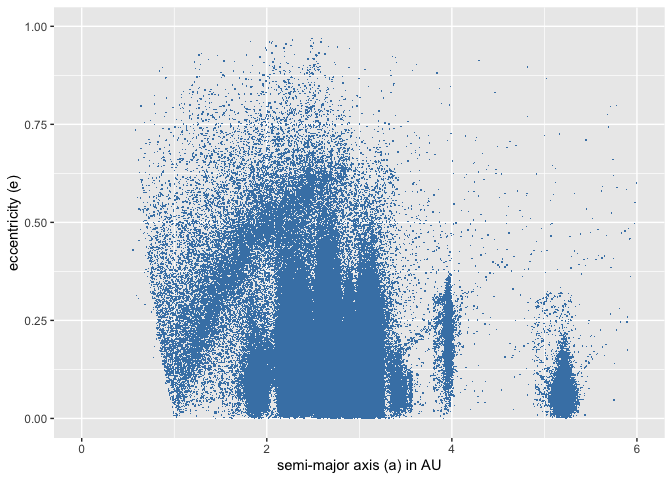<!-- -->

There are some 'artefacts' which appear as striped patterns directed to the right. Some of them might be objects with only a few observations. The algorithm that calculates the orbital parameters could to make some assumptions which result in these striped patterns. We can test this idea and make them visible by selecting objects with less than 20 observations and plotting them in red.

```r
ast_df20 <- ast_df %>% filter(n_obs_used < 20)
ggplot(data = ast_df) + geom_point(mapping = aes(x = a, y = e), shape = ".", color = "steelblue") + 
  geom_point(ast_df20, mapping = aes(x = a, y = e), shape = ".", color = "indianred") + xlim(c(0,6)) +
  labs (x = "semi-major axis (a) in AU", y = "eccentricity (e)")
```

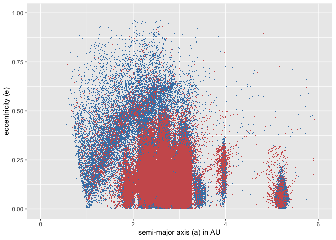<!-- -->
This seems to prove the idea. Next we filter out potentially unreliable orbital parameters by removing all objects with less than 20 observations and making a new plot.


```r
ast_df1 <- ast_df %>% filter(n_obs_used >= 20 & a > 0)
ggplot(data = ast_df1) + geom_point(mapping = aes(x = a, y = e), shape = ".", color = "steelblue") + 
  xlim(c(0,6)) + labs (x = "semi-major axis (a) in AU", y = "eccentricity (e)")
```

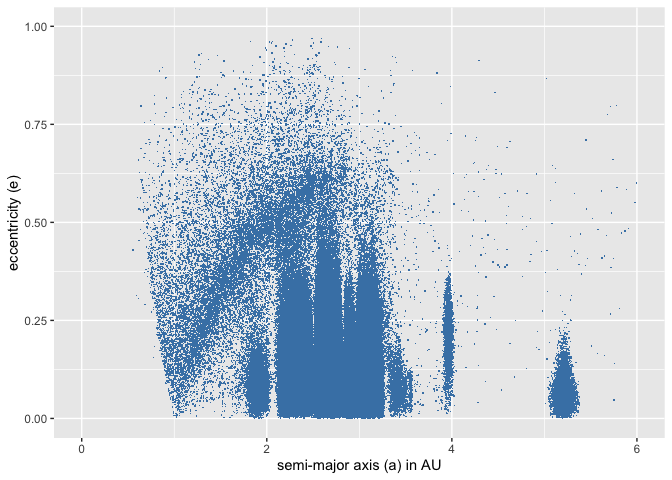<!-- -->

There is still a striped pattern starting at 1 AU and 0 eccentricity directed to the right. This could be connected to how we detect asteroids. If asteroids are close to the Earth's orbit, we are more likely to detect them.
We can use the aphelion and perihelion (https://en.wikipedia.org/wiki/Apsis) data of Earth and other planets and calculate the eccentricity at each semi-major axis. In a plot we can examine the higher asteroid density starting at 1 AU and extending to 2 AU in the form of an arc. Remembering that $aphelion = a(1+e)$ and $perihelion = a(1-e)$ we rearrange to calculate the eccentricities for the planets. We also plot the eccentricities of Mercury, Venus, Earth, Mars and Jupiter.

```r
a <- seq(0.1, 20, 0.01)
#Aphelion Earth using AU
eEarthQ <- 1-(1.01668953984936/a)
#Perihelion Earth using AU
eEarthq <- (0.983308544860961/a)-1
#Aphelion Mars using AU
eMarsQ <- 1-(1.66615924573989/a)
#Perihelion Mars using AU
eMarsq <- (1.38121318598389/a)-1
#Aphelion Jupiter using AU
eJupQ <- 1-(5.45669201672052/a)
#Perihelion Jupiter using AU
eJupq <- (4.94785062331118/a)-1
ggplot() + geom_point(ast_df1, mapping = aes(x = a, y = e), shape = ".", color = "steelblue") + 
  xlim(c(0,6)) + ylim(c(0,1)) + geom_line(mapping = aes(x = a, y = eEarthQ), color = "red") +
  geom_line(mapping = aes(x = a, y = eEarthq), color = "red") +
  geom_line(mapping = aes(x = a, y = eMarsQ), color = "darkgreen") +
  geom_line(mapping = aes(x = a, y = eMarsq), color = "darkgreen") +
  geom_line(mapping = aes(x = a, y = eJupQ), color = "purple") +
  geom_line(mapping = aes(x = a, y = eJupq), color = "purple") +
  geom_point(mapping = aes(x = planets$a, y = planets$e)) +
  labs (x = "semi-major axis (a) in AU", y = "eccentricity (e)")
```

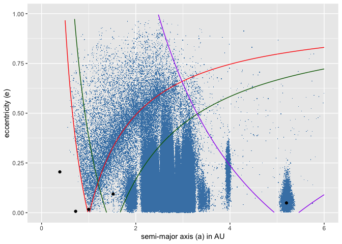<!-- -->

Now it is obvious why the density of asteroids is higher close to the aphelion distance of the Earth (red line on the right). It is easier to detect asteroids near the Earth's orbit. The perihelion distance is the red line on the left. The other lines show the aphelion and perihelion distance of Mars (green) and Jupiter (purple). We also see objects crossing the aphelion and perihelion distance of planets.
Asteroids in general have larger eccentricities than planets (even larger than Mercury = 0.205, also see https://nssdc.gsfc.nasa.gov/planetary/factsheet/). Collisions between asteroids and the Yarkowvsky effect can alter the orbit of asteroids in the long term (https://en.wikipedia.org/wiki/Yarkovsky_effect).
Around Jupiter there are the Jupiter trojans lying at the L4 and L5 points (https://en.wikipedia.org/wiki/Jupiter_trojan). 

We can also filter out the Near-Earth objects (NEO) and potentially hazardous objects (PHA) and use different colours for them.


```r
neo <- ast_df1 %>% filter(neo == "Y")
pha <- ast_df1 %>% filter(pha == "Y")
print(paste("Number of PHAs ", nrow(pha)))
```

```
## [1] "Number of PHAs  1966"
```

```r
print(paste("Number of NEOs ", nrow(neo)))
```

```
## [1] "Number of NEOs  18206"
```

Now lets plot them.


```r
a <- seq(0.1, 20, 0.01)
#Aphelion Earth using AU
eEarthQ <- 1-(1.01668953984936/a)
#Perihelion Earth using AU
eEarthq <- (0.983308544860961/a)-1
#Aphelion Mars using AU
eMarsQ <- 1-(1.66615924573989/a)
#Perihelion Mars using AU
eMarsq <- (1.38121318598389/a)-1
#Aphelion Jupiter using AU
eJupQ <- 1-(5.45669201672052/a)
#Perihelion Jupiter using AU
eJupq <- (4.94785062331118/a)-1
ggplot() + geom_point(ast_df1, mapping = aes(x = a, y = e), shape = ".", color = "green") + 
  geom_point(neo, mapping = aes(x = a, y = e), shape = ".", color = "yellow") +
  geom_point(pha, mapping = aes(x = a, y = e), shape = ".", color = "red") +
  xlim(c(0,6)) + ylim(c(0,1)) + geom_line(mapping = aes(x = a, y = eEarthQ), color = "red") +
  geom_line(mapping = aes(x = a, y = eEarthq), color = "red") +
  geom_line(mapping = aes(x = a, y = eMarsQ), color = "darkgreen") +
  geom_line(mapping = aes(x = a, y = eMarsq), color = "darkgreen") +
  geom_line(mapping = aes(x = a, y = eJupQ), color = "purple") +
  geom_line(mapping = aes(x = a, y = eJupq), color = "purple") +
  geom_point(mapping = aes(x = planets$a, y = planets$e)) +
  labs (x = "semi-major axis (a) in AU", y = "eccentricity (e)")
```

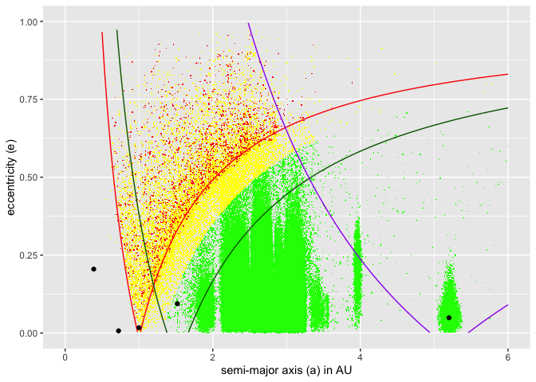<!-- -->

PHAs are red, NEOs are yellow and all other asteroids are green.

# 3. Kirkwood gaps

Lets explore the gaps by plotting a histogram for a distance up to 6 AU.

```r
ggplot(ast_df1, aes(x = a)) + geom_histogram(aes(y = ..count..), binwidth = 0.005, color = "blue") + xlim(c(0,6)) +
  labs (x = "semi-major axis (a) in AU", y = "objects per bin (0.005 AU)")
```

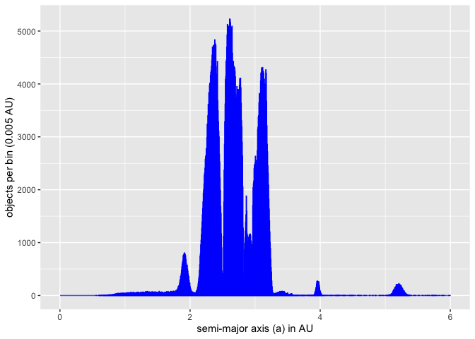<!-- -->

```r
ggplot(ast_df1, aes(x = a)) + geom_histogram(aes(y = ..count..), binwidth = 0.005, color = "blue") + xlim(c(1.8,3.5)) +
  labs (x = "semi-major axis (a) in AU", y = "objects per bin (0.005 AU)")
```

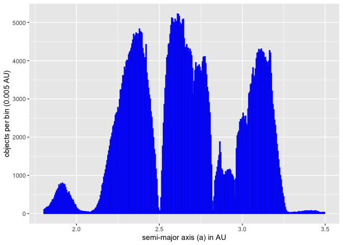<!-- -->
We find gaps, regions with less asteroids, at about 2.06, 2.5, 2.82, 2.95, 3.27 AU. These are the Kirkwood gaps, first noticed by Daniel Kirkwood in 1866. They have been depleted by mean-motion resonances (MMR) of Jupiter or Neptune (<https://en.wikipedia.org/wiki/Kirkwood_gap>). There are also resonances in the outer solar system, e.g. around 30 AU (https://en.wikipedia.org/wiki/Orbital_resonance).

```r
ggplot(ast_df1, aes(x = a)) + geom_histogram(aes(y = ..count..), binwidth = 0.05, color = "blue") + xlim(c(28,50)) +
  labs (x = "semi-major axis (a) in AU", y = "objects per bin (0.05 AU)")
```

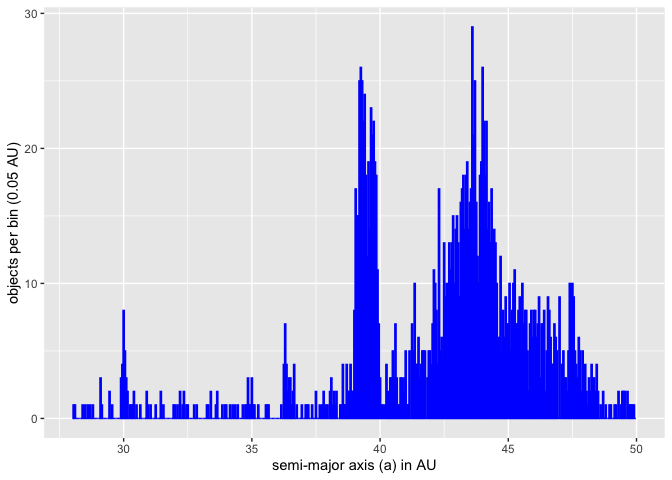<!-- -->

# 4. Inclination and asteroid families
The next plot is inclination versus semi-major axis. There appear to be finger like shapes.

```r
ggplot(data = ast_df1) + geom_point(mapping = aes(x = a, y = i), shape = ".", color = "steelblue") + 
  xlim(c(0,6)) + ylim(c(0,40)) + labs (x = "semi-major axis (a) in AU", y = "inclination (i) in degrees")
```

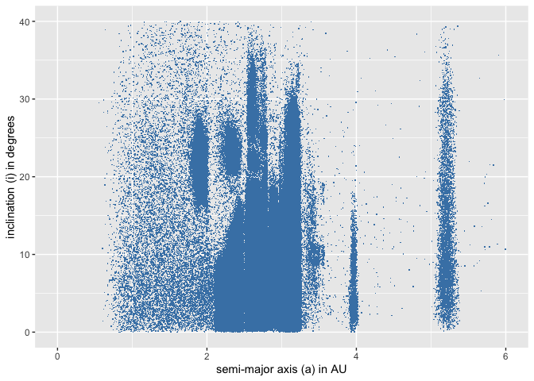<!-- -->

Zooming in and adding the density of the distribution shows concentrations of asteroids.


```r
ggplot(data = ast_df1) + stat_bin_2d(mapping = aes(x = a, y = i), bins = 150) + 
  xlim(c(1.5,3.5)) + ylim(c(0,30)) + labs (x = "semi-major axis (a) in AU", y = "inclination (i) in degrees") +
  scale_fill_viridis_c(option = "plasma") + theme(line = element_blank(),
        panel.background = element_rect(fill = "darkblue"))
```

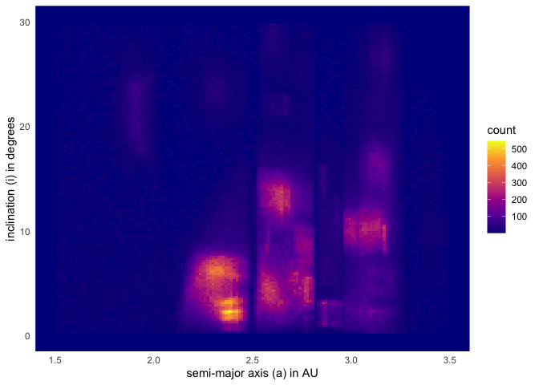<!-- -->

We find concentrations of asteroids that share the same orbital elements. They are grouped into families (https://en.wikipedia.org/wiki/Asteroid_family#List_of_asteroid_families). A better plot can be made using proper orbital elements instead of osculating orbital elements. Proper elements are stable for several millions of years while osculating elements are only stable for shorter timescales. The AstDyS-2 website has data for asterods, osculating and proper elements (https://newton.spacedys.com/astdys/index.php?pc=0). Using this data can be used for a new plot.

# 5. Asteroid spectral types

We can also examine taxonomic classification from the Small Main-Belt Asteroid Spectroscopic Survey (SMASS) of 1,477 asteroids. (https://en.wikipedia.org/wiki/Asteroid_spectral_types)

The main groups are C (carbonacious), S (silicaceous) and X (metallic).


```r
spec_type <- ast_df %>% group_by(spec_B) %>% tally
# delete sum in first row
spec_type <- spec_type[-1,]
```


```r
ggplot(spec_type, aes(spec_B, n)) + geom_col(color = "blue", fill = "blue") +
  labs (x = "SMASS II spectral type", y = "number of asteroids")
```

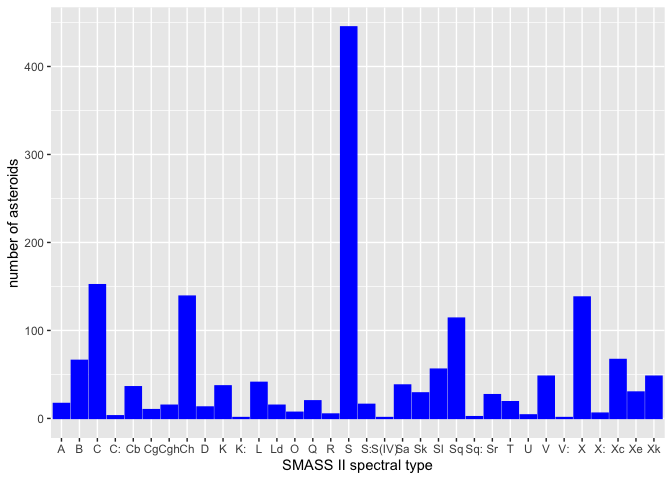<!-- -->
In this sample the silicaceous (stony) objects dominate.

# Appendix{-}
Here is a list of the data table.

Column  | Description                                                | Data Field
------- | ---------------------------------------------------------- | -----------
0       |	object full name/designation                               | full_name
1	      | [ a ] semi-major axis (AU)	                               | a
2       |	[ e ] eccentricity	                                       | e
3	      | [ i ] inclination (deg)	                                   | i
4	      | longitude of the ascending node (deg)                      | om
5	      | argument of the perihelion (deg)	                         | w
6	      | [ q ] perihelion distance (AU)	                           | q
7	      | [ Q ] aphelion distance (AU)	                             | ad
8	      | orbital period (years)	                                   | per_y
9	      | number of days spanned by the data-arc (d)                 | data_arc
10	    | orbit condition code (MPC 'U' parameter)                   | condition_code
11	    | number of observations (all types) used in fit	           | n_obs_used
12	    | number of delay-radar observations used in fit	           | n_del_obs_used
13	    | number of Doppler-radar observations used in fit           | n_dop_obs_used
14	    | absolute magnitude parameter (mag)	                       | H
15	    | object diameter (from equivalent sphere) (km)	             | diameter
16	    | object bi/tri-axial ellipsoid dimensions (km)	             | extent
17	    | geometric albedo	                                         | albedo
18	    | rotation period (h)	                                       | rot_per
19      | mass expressed as product mass and grav. const. G (km³/s²) | GM
20	    | color index B-V (mag)	                                     | BV
21	    | color index U-B (mag)	                                     | UB
22	    | color index I-R (mag)	                                     | IR
23	    | spectral taxonomic type (SMASSII)	                         | spec_B
24	    | spectral taxonomic type (Tholen)	                         | spec_T
25	    | Near-Earth Object (NEO) flag (Y/N)	                       | neo
26	    | Potentially Hazardous Asteroid (PHA) flag (Y/N)	           | pha


